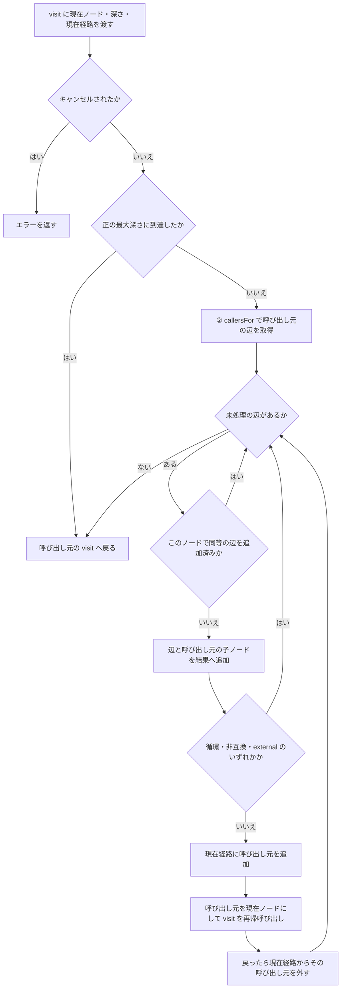
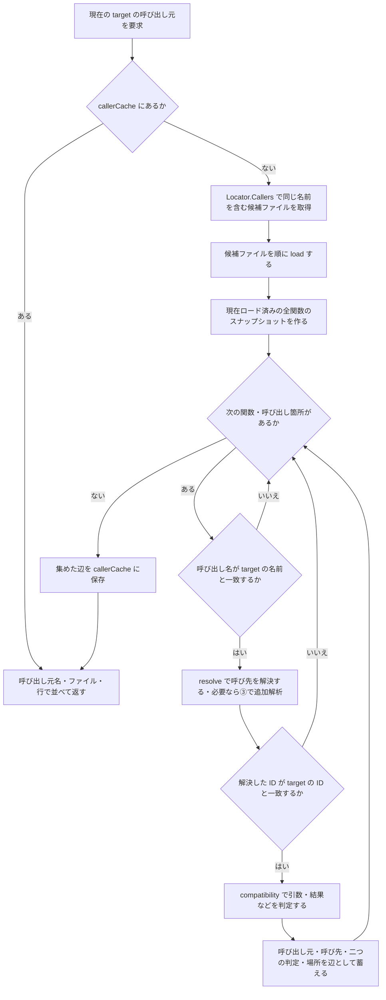
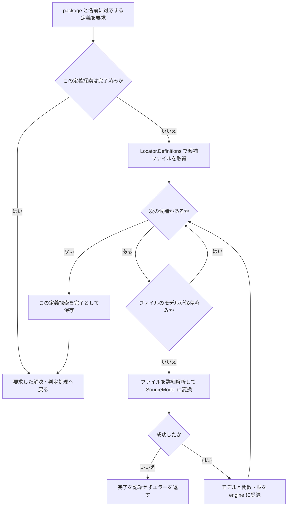

# 図で追う解析ロジックのサイクル

この資料は、現行実装が何を反復し、どこへ戻り、どの条件で終わるかを説明します。
rev-callgraph 自体がソースコードを調べる処理を示しており、解析対象の Go プログラムの実行順ではありません。
図は Mermaid 対応の Markdown ビューアーで表示できます。

## 全体像：準備のあとに三つのループが入れ子になる

```text
一回だけの準備
  target を解釈 → module・source を発見 → 索引を作成
  → 起点の定義候補を詳細解析 → 起点ノードを作成

① 現在の関数の呼び出し元を取得する
   ② 候補の関数と、その中の呼び出し箇所を順に調べる
      ③ 必要な定義候補ファイルを順に読み、解析済みモデルへ蓄える
      呼び先を照合 → 一致すれば互換性を判定 → 辺を蓄える
   呼び出し元の一覧を確定・保存する
   各辺を結果へ追加する
   継続できる辺では、呼び出し元を「現在の関数」にして①へ再帰する
   再帰から戻ったら、残りの辺へ進む

全ての枝が終わったら tree・JSON・DOT に整形する
```

中心は **一つの関数について呼び出し元の一覧を作り、その各呼び出し元で同じ処理を繰り返す** サイクルです。
全関数を何周も再計算して収束させる方式ではなく、必要なファイルを読み足しながら深さ優先で逆探索します。
このため、処理の戻り先を表せるフローチャートを中心にしています。

## 準備：探索の対象と索引を固定する

`AnalyzeWithPolicy` は次の順で一回の解析を準備します。

1. `ParseTarget` で package・receiver・関数名を取り出す。
2. `Discover` で module を発見し、symbol set・GOOS/GOARCH などに合う source を列挙する。
3. `NewLocator` で対象ファイルの定義名・識別子名を索引化する。
4. 新しい engine と空のキャッシュを作る。
5. `definitions` で起点の定義候補を読み、起点ノードを作って `visit` を開始する。

起点の定義がなくても、起点ノードは作ります。
削除された関数への呼び出しを調べられる場合があるためです。
発見や索引作成は最初に対象全体へ行い、詳細解析だけを必要になったファイルへ限定します。

## ① 外側のループ：呼び出し元を一段ずつ逆にたどる

対象は `AnalyzeWithPolicy` 内の再帰関数 `visit` です。
起点の深さは 0 です。



`Recurse` ではこの図の先頭へ、深さを一つ増やして入ります。
その処理を終えてから、元のノードの次の辺へ進みます。
取得処理や再帰からエラーが返った場合も、解析を終了してエラーを返します。

停止判定より先に子ノードを追加するため、非互換の呼び出し元も結果に残ります。
循環は現在経路だけで判定し、別経路で同じ関数へ到達してもその枝を残します。
全体の辺一覧では同等の辺を重複登録しませんが、これは別経路の探索を省く判定ではありません。

既定では `incompatible` を越えません。
内部 API の `TraversalPolicy` で継続を指定した場合は、この非互換による停止だけを解除します。
`unknown` 自体は停止条件ではありません。

## ② 内側のループ：候補から実際の呼び出し元を選ぶ

対象は `callersFor` と `callerCandidates` です。
ここでいう target は、CLI の最初の起点だけでなく、①で現在調べている関数を指します。



索引の候補は広めに取得します。
名前が書かれているだけでは採用せず、呼び先の ID まで一致したものだけを辺にします。
別 module 系列など、`resolve` が target の ID を返さない関係もここで除外されます。

解決中には追加の関数定義がロードされることがあるため、関数一覧をスナップショットにして走査します。
追加ロードのたびにこのループの先頭へ戻って全関数を走査し直すことはありません。
走査が成功した後で、空の結果も含めてキャッシュに保存します。
同じ target を別の枝から調べるときは、この一覧を再利用します。

## ③ 定義を補うループ：候補ファイルを読み足して元の判定へ戻る

`resolve` は package・receiver・名前から定義を探します。
メソッド探索や型の照合でも、必要に応じて `definitions` を使って情報を補います。
以下は `definitions` と `load` の共通経路です。



一度登録したファイルは同じ解析中には再解析しません。
候補を調べ終えたら、呼び出し元の解決・判定処理が蓄えた情報を使って続行します。
「定義探索が完了した」は「定義が存在した」と同義ではなく、候補が空の場合も完了になります。

`resolve` はローカル定義、メソッドや別名、外部宣言などを条件に応じて調べ、`resolved`・`external`・`unknown` を返します。
続く `compatibility` は別軸で `compatible`・`incompatible`・`unknown` を返します。
判定不能だからといって、無制限に追加解析を繰り返す処理ではありません。

上図のエラーを `definitions` は呼び出し側へ返します。
`resolve` などが伝播するエラーは解析を終了させますが、一部の型照合では定義探索のエラーを伝播せず、得られた情報で判定を続けます。
また、標準ライブラリなどの外部宣言には別のキャッシュがあり、取得失敗も保存して同じ実行中の再試行を抑えます。

## 一つの例で、進む順番と戻る場所を追う

実際の呼び出しを `A → B → C → Target` と `D → C` とします。
`B → C` だけが引数数の不一致で非互換、ほかは解決済み・互換とし、深さ制限はないものとします。
名前順で `B` の枝が `D` より先に処理される例です。

| 順番 | 現在の処理 | 次に進む場所 |
| --- | --- | --- |
| 1 | `visit(Target)` が②で `C → Target` を取得 | `C` を結果に追加して `visit(C)` へ |
| 2 | `visit(C)` が②で `B → C` と `D → C` を取得 | 先に `B → C` を処理 |
| 3 | `B` を結果に追加し、非互換で停止 | `visit(B)` は呼ばず、`C` の残りの辺へ |
| 4 | `D` を結果に追加し、互換なので継続 | `visit(D)` へ |
| 5 | `D` の呼び出し元がない | `visit(C)` へ戻る |
| 6 | `C` の辺を全て処理済み | `visit(Target)` へ戻る |
| 7 | `Target` の辺も全て処理済み | 結果を出力する |

```text
Target
  C
    B [非互換]
    D
```

`A` はこの経路からは探索されません。
`B → C` の互換性が `unknown` で、ほかの停止条件がなければ、順番 3 で `visit(B)` に進み、`A` までたどります。
同じ `B → C` に互換な呼び出し箇所もあれば、その辺は別に残り、そこから `A` を探索します。

## コードとの対応

| 処理 | 実装 |
| --- | --- |
| 準備・候補索引 | [discovery.go](../internal/analysis/discovery.go) の `Discover`・`NewLocator` |
| ① 逆探索 | [engine.go](../internal/analysis/engine.go) の `AnalyzeWithPolicy` 内の `visit` |
| ② 候補の選別 | 同ファイルの `callersFor`・`callerCandidates` |
| ③ 定義の追加解析 | 同ファイルの `definitions`・`load` |
| 呼び先の解決 | 同ファイルの `resolve`・`method` |
| 呼び出しの互換性 | [compatibility.go](../internal/analysis/compatibility.go) |

操作方法は [使い方](usage.md)、判定の意味や制限は [仕様](spec.md)、内部の不変条件は [解析アーキテクチャ](ai/architecture.md) を参照してください。
実装・仕様の変更時には、この資料のループと例も同期します。
