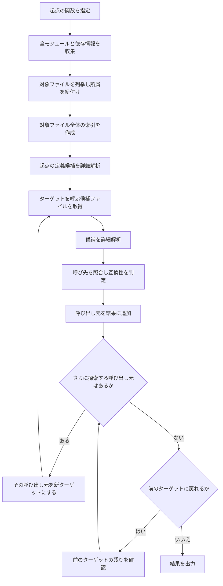
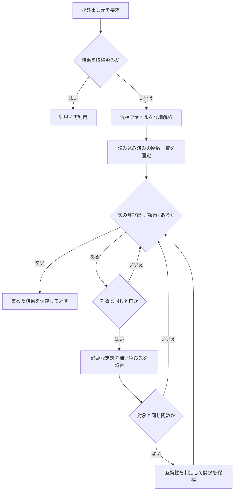
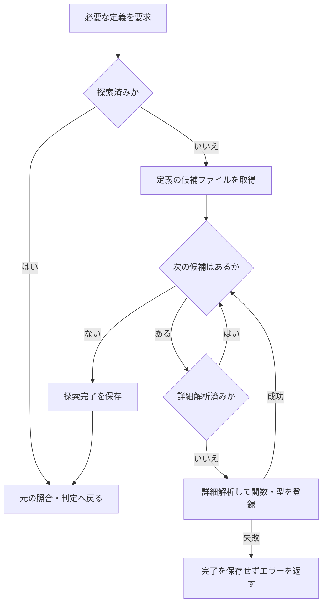

# 図で追う解析の全体像

指定した関数から、呼び出し元を一段ずつ逆向きに調べる流れです。
解析対象のプログラムを実行するのではなく、ソースコードを読み取ります。

## 用語

| 用語 | この資料での意味 |
| --- | --- |
| ワークスペース | 調査対象として指定したディレクトリ全体 |
| モジュール | `go.mod` を単位とするコードのまとまり。依存先やバージョンを持つ |
| パッケージ | モジュール内の Go ファイルのまとまり。通常はディレクトリ単位で、外部テスト用は別に扱う |
| ターゲット | 今、呼び出し元を調べている関数・メソッド。探索が進むと入れ替わる |
| 呼び出し元 | ターゲットを呼ぶ関数。`A → B` なら、B の呼び出し元は A |
| 候補ファイル | 関係する名前を含むファイル。実際に対象を呼ぶかは、まだ未確定 |
| 索引 | 名前から候補ファイルを探すための一覧 |
| 詳細解析 | ファイル内の関数・型・呼び出しを読み取り、判定に使う情報へ変換すること |
| 互換性 | 呼び出しの引数や戻り値が、現在の定義に合っているかの判定 |
| キャッシュ | 同じ解析中に再利用する、解析済みの情報や探索結果 |

## 全体の流れ

**準備は一回だけ行い、呼び出し元を新しいターゲットにして探索を繰り返します。**



- **準備**：`go.mod` の依存・置換情報を読み、対象ファイルを所属モジュール・パッケージへ紐付けます。
  OS・CPU・テストを含むかの条件で対象を絞ります。
- **探索**：名前で候補を探し、実際の呼び先を照合します。
  必要な関数・型の定義が別ファイルにあれば追加解析して、照合・判定へ戻ります。
- **繰り返し**：一つの呼び出し元を先にたどり終えてから、前のターゲットの残りへ戻ります。
  解析済みファイルや取得済みの呼び出し元一覧は再利用します。
- **停止**：候補なし、循環、最大深さ、明確な非互換、解析対象外の境界では、その先を探索しません。
  既に追加した呼び出し元は結果に残し、他の経路を続けます。

現行実装では、モジュールとファイルの所属は最初に収集します。
ターゲットが変わるたびに所属モジュールを発見し直したり、そのパッケージ全体を初めて読み込んだりする構成ではありません。
図は正常処理の概略で、深さ制限は候補取得前、循環・非互換・解析対象外の判定は呼び出し元の追加後に行います。

## 具体例：進んで、戻って、次へ進む

呼び出しが `A → B → Target` と `C → Target` なら、次の順で調べます。
ここでは全て互換で、B を C より先に調べるものとします。

```text
Target を調べる → 呼び出し元 B と C が見つかる
  B を調べる → 呼び出し元 A が見つかる
    A を調べる → 呼び出し元なし → B へ戻る
  B の残りなし → Target へ戻る
  C を調べる → 呼び出し元なし → Target へ戻る
Target の残りなし → 結果を出力
```

結果は `Target` の下に `B → A` と `C` が並びます。
もし `B → Target` が非互換なら、B 自身は残し、A はこの経路から調べず C へ進みます。
情報不足で互換性が不明なだけなら、ほかの停止条件がない限り A へ進みます。

## 必要に応じて読む詳細

<details>
<summary>候補から呼び出し元を選ぶ流れ</summary>



索引は広めに候補を返すため、名前だけで呼び出し元とは確定しません。
モジュールの系列なども照合し、対象の関数に一致する関係だけを採用します。
同じ major 系列なら minor・patch の違いは許容しますが、系列の一致は API の互換性を保証しません。
解決中に別の関数定義が増える場合があるため、走査する関数一覧は事前に固定します。
空の結果も、探索が成功した後に保存します。

</details>

<details>
<summary>不足する定義を読み足す流れ</summary>



未解析と、探索した結果の定義なしは別です。
定義の候補が空でも探索は完了しますが、それは定義の存在を意味しません。
キャッシュは一回の解析に属し、異なる解析条件へ持ち越しません。
一部の型照合では追加探索のエラーを伝播せず、得られた情報で判定を続けます。
外部宣言には別のキャッシュがあり、取得失敗も保存して同じ実行中の再試行を抑えます。

</details>

<details>
<summary>探索を止める条件と、二つの判定</summary>

| 判定 | 値と意味 |
| --- | --- |
| 呼び先の解決 | `resolved`：内部の定義を特定、`external`：解析対象外の境界、`unknown`：定義情報が不足 |
| 互換性 | `compatible`：確認した範囲で適合、`incompatible`：明確な不一致、`unknown`：判定材料が不足 |

二つは独立しています。
例えば定義を特定できても引数数が違えば、解決済み・非互換になります。
不明という判定だけでは止めませんが、もう一方が停止条件なら止まります。

- 非互換と解析対象外の境界：呼び出し元を残して、その先で停止します。
- 循環：現在の経路に同じ関数があれば、循環した箇所を残して停止します。
  別の経路からの到達は妨げません。
- 最大深さ：起点を 0 とし、指定した深さの関数を残して、その呼び出し元は取得しません。
  `--max-depth` が 0 以下なら深さ制限なしです。
- エラー・キャンセル：上位へ伝播した場合は解析全体を終了します。

同じ呼び出し元・呼び先でも判定が違えば、別の関係として残します。
一部に非互換な呼び出しがあっても、互換な呼び出しからの探索は続けます。
内部 API では非互換を越える設定も可能ですが、既定の CLI は非互換で停止します。

</details>

## コードとの対応

実装を確認するときの参照先です。

| 処理 | 実装 |
| --- | --- |
| モジュール・ファイルの収集と索引 | [discovery.go](../internal/analysis/discovery.go) の `Discover`・`NewLocator` |
| 呼び出し元を次の対象にする探索 | [engine.go](../internal/analysis/engine.go) の `AnalyzeWithPolicy` 内の `visit` |
| 候補の選別 | 同ファイルの `callersFor`・`callerCandidates` |
| 定義の追加解析 | 同ファイルの `definitions`・`load` |
| 呼び先の解決 | 同ファイルの `resolve`・`method` |
| 互換性の判定 | [compatibility.go](../internal/analysis/compatibility.go) |

操作方法は [使い方](usage.md)、判定の制限は [仕様](spec.md)、内部の不変条件は [解析アーキテクチャ](ai/architecture.md) を参照してください。
実装・仕様の変更時には、この資料の図・用語・例も同期します。
